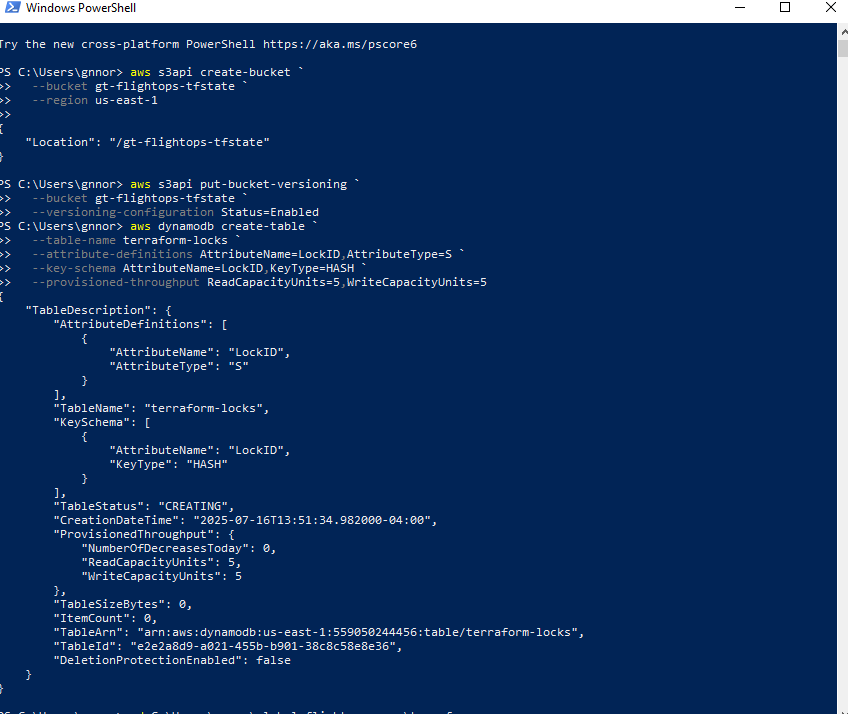
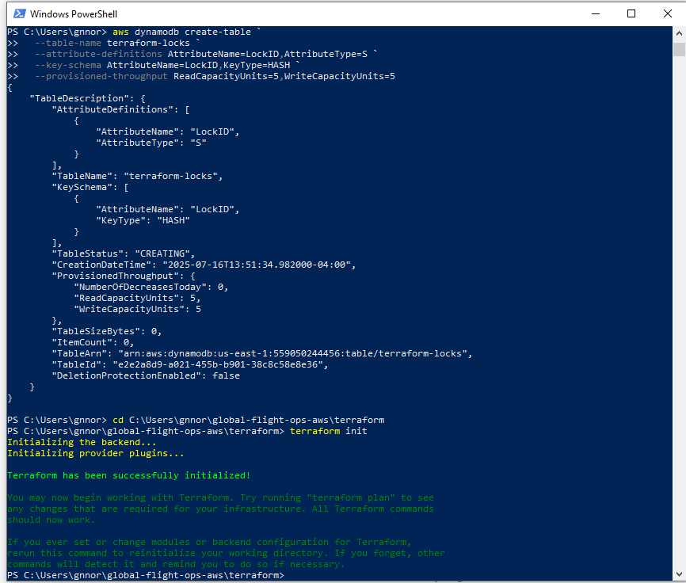
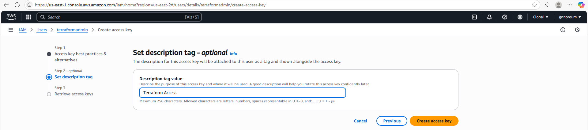
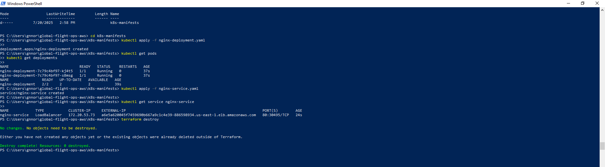
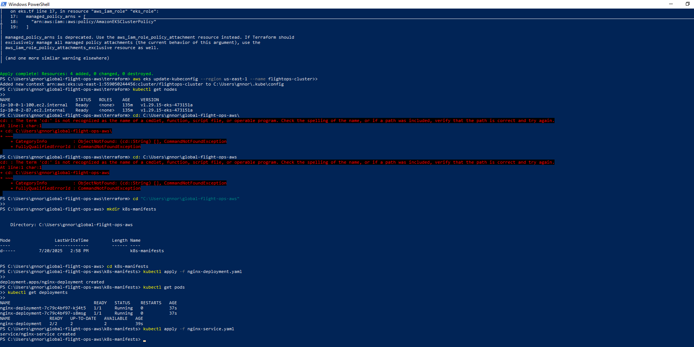
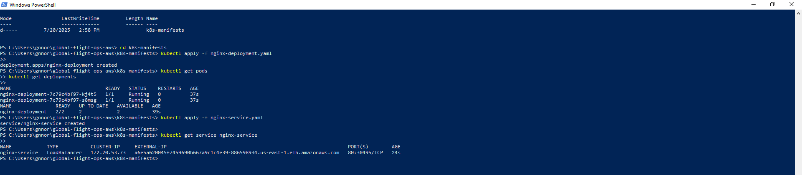
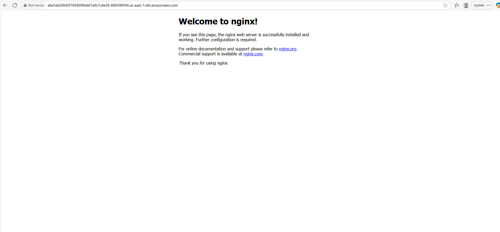

# Global Flight Operations Infrastructure (AWS + Terraform + Kubernetes)

## Overview
This project demonstrates deployment of airline-grade cloud infrastructure using AWS EKS provisioned with Terraform and containerized workloads deployed using Kubernetes.

## Architecture
AWS VPC infrastructure was provisioned using Terraform including public and private subnets, routing, and IAM roles.  
An Amazon EKS cluster was deployed with managed worker nodes hosting containerized applications.

## Deployment Verification

### Kubernetes Pods Running
(Add screenshot here)

### LoadBalancer Service
(Add screenshot here)

### Public Application Endpoint
(Add nginx webpage screenshot here)

## Technologies Used
- AWS EKS
- Terraform
- Kubernetes
- Docker
- IAM
- VPC Networking
## 📸 Deployment Screenshots

---

### Terraform Backend & Initialization

**S3 Backend Configured**

**Terraform Backend Configuration**

**Terraform Initialization Successful**

---

### Infrastructure Provisioning

**Terraform Plan — Infrastructure Creation**

**Terraform Apply — Successful Deployment**

---

### AWS Networking Deployment

**VPC and Subnet Deployment**

---

### IAM & EKS Cluster Setup

**Terraform IAM Admin Configuration**

**EKS Cluster Provisioned Successfully**

---

### Kubernetes Workload Deployment

**Running Kubernetes Pods**

**LoadBalancer Service Created**

---

### Live Application Validation

**Nginx Application Accessible via External Endpoint**

